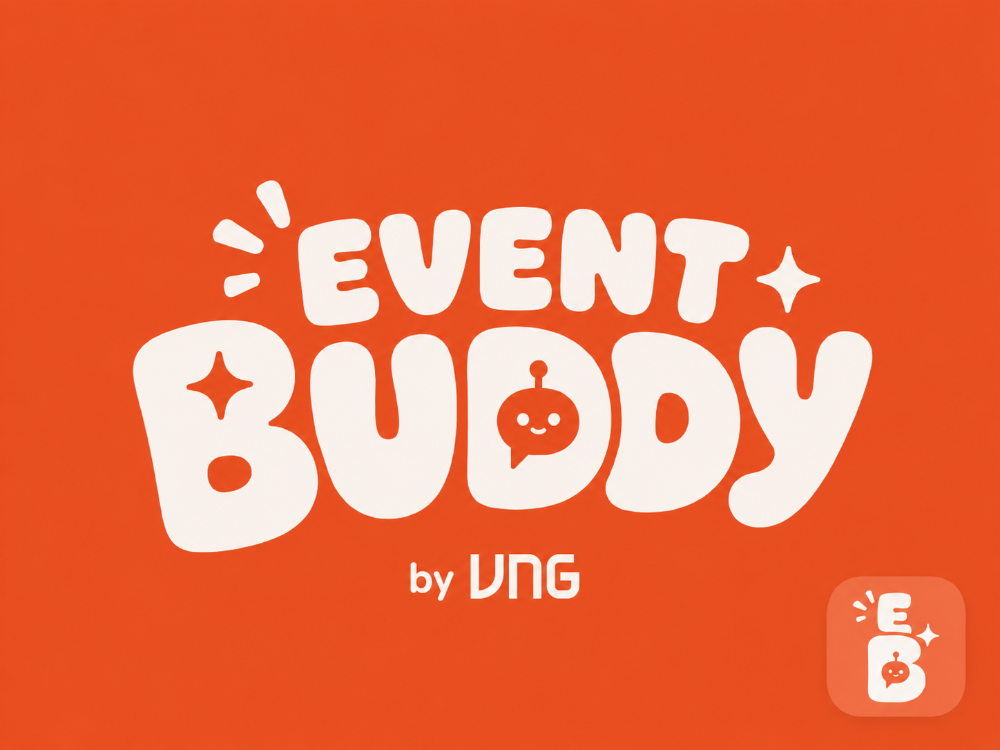

<p align="center">
  
</p>

<h1 align="center">EventBuddy</h1>

<p align="center">
  <strong>The AI teammate that runs your event lifecycle — right inside Microsoft Teams.</strong>
</p>

<p align="center">
  Create → focus → remind → report, all from one conversation.
</p>

<p align="center">
  🌐 <a href="https://endpoint-0a09ccce-2059-4ce4-b1b7-8a35d674aa0c.agentbase-runtime.aiplatform.vngcloud.vn/"><strong>Live landing page &amp; install</strong></a>
  &nbsp;·&nbsp;
  📖 <a href="documents/Teams-Setup-Guide.md">Teams Setup Guide</a>
  &nbsp;·&nbsp;
  🏗 <a href="documents/System-Architecture.md">System Architecture</a>
</p>

<p align="center">
  🌐 <strong>English</strong> · <a href="README.vi.md">Tiếng Việt</a>
</p>

---

## The problem

Running one internal event is the same fixed lifecycle every single time:

```
announce → distribute registration → chase registrations → remind before D-day
        → collect feedback → write the post-event report
```

For the organizers (Event Organizer / Employee Engagement / L&D teams) that's **4–6 hours of
manual overhead per event** — copy-pasting member lists, chasing non-responders one by one,
re-typing the same reminder across email and chat, and assembling a report by hand. They usually
run **2–3 events at once**, so the busywork multiplies and the contexts blur together.

**EventBuddy collapses that into a single conversation.** You describe the event once; the agent
keeps each event's context isolated and does the repetitive coordination — provisioning a
workspace, reading planning files, sending personalized reminders, and writing the report with
suggestions for next time.

---

## What you can do with it

EventBuddy is conversational — you describe what you need and it does the work. The use cases below
follow the **event lifecycle**, from kickoff to report. Everything here is something the agent
actually does today; the quoted lines are just examples — you don't need exact wording.

### 1. 🎬 Start an event and its workspace
Turn a conversation into an organized event. In a 1-1 chat, create an event together with its
organizing team. In a group chat or channel, just say it's for an event — EventBuddy adopts that
conversation as the event's shared workspace and starts tracking it. Working on several at once?
List them and *focus* on one, and everything you say next applies to it.
> 💬 *"Create an event called Spring Hackathon with thoptk and phucnlt2."*
> 💬 *"This group is for the Spring Hackathon — help us organize."*
> 💬 *"What events am I in?"* → *"Focus on the Hackathon."*

### 2. 👥 Build the team and the guest list
Add organizers by their corporate identity, so each person is recognized in their own private chat
with the bot. Separately, read an **attendee roster** (an xlsx/csv list) to see who's coming and who
still needs chasing — attendees stay distinct from the organizing team.
> 💬 *"Add the new people in this group to the event."*
> 💬 *"Read participants.csv and tell me who hasn't registered yet."*

### 3. ✅ Track the work
Keep a shared task board in plain language — create tasks, assign them, set or move deadlines, and
update status. Ask for just your own tasks, or the whole board with every assignee.
> 💬 *"Add a task to book the venue, assign it to Lan, due June 25."*
> 💬 *"Mark the catering task done."* · *"What's left to do?"*

### 4. 📣 Remind and message — without the copy-paste
Send reminders, emails, or direct Teams messages — to the whole team, to specific people, or only to
the people on the roster who **haven't registered yet**. Need everyone to get a *different* message?
Personalize per recipient in a single batch. **Every send shows a confirmation card first**, so
nothing goes out until you approve exactly who gets what.
> 💬 *"Remind everyone about tomorrow's deadline."*
> 💬 *"Chase only the participants who are still pending."*
> 💬 *"Message each speaker their own session time."* (a different message per person)

### 5. 📂 Work with files and discussion
Browse and read the files shared in the chat or channel — an agenda, a budget, a mail template, a
roster — just by name, no link needed. EventBuddy understands **Office docs, PDF, CSV, and text**,
and reads **images and scanned PDFs** with a vision model. It can also catch up on and brainstorm
around the channel discussion.
> 💬 *"Read the budget file and tell me the total."*
> 💬 *"Summarize what we've discussed and suggest a theme."*

### 6. 📊 Collect feedback and write the report
Attach a feedback **Form** and its responses workbook to the event, then have EventBuddy generate an
**AI post-event report** — a summary with concrete, data-backed suggestions for doing the next event
better.
> 💬 *"Use this Form for feedback."* → later → *"Write the post-event report."*

### 7. 🌍 Research on the web (optional)
When web search is enabled, EventBuddy can look up external facts or gather inspiration for ideas.
> 💬 *"Find icebreaker activities for a 50-person hackathon."*

> **Who can do what** is scope-aware: in a 1-1 chat you're the *host*; a group chat is a flat peer
> space where *everyone* can act; a team channel uses real membership roles. The model can **never**
> spoof who it's acting as — identity always comes from the server, never from the conversation.

---

## Try it

| | |
|---|---|
| **Landing page** | https://endpoint-0a09ccce-2059-4ce4-b1b7-8a35d674aa0c.agentbase-runtime.aiplatform.vngcloud.vn/ |
| **Install** | Download `eventbuddy.zip` from the landing page → Teams **Apps → Manage your apps → Upload a custom app** |
| **Full walkthrough** | [Teams Setup Guide](documents/Teams-Setup-Guide.md) |

Once installed, open a 1-1 chat with EventBuddy, type **`sign in`** and click the button to connect
your Microsoft 365 account — then just talk to it: *"Create an event called Demo Day with \<your
teammates\>"* → *"what are my tasks?"*

---

## How it works

```
Teams (DM · group chat · channel)
        │  Bot Framework activities (via Azure Bot Service)
        ▼
FastAPI ingress  →  Bot Gateway (JWT + scope/role)  →  Orchestrator (routing seam)
                                                          │
                          ┌───────────────────────────────┴───────────────────────────┐
                          ▼                                                             ▼
              LangGraph create_react_agent                                  deterministic regex router
              (LLM tool-calling loop)                                        (graceful fallback)
                          │
                          ▼
              typed, context-bound tools  →  capabilities  →  Postgres · Redis · MS Graph · MaaS LLM
```

- **One routing seam, two brains.** The Orchestrator runs an LLM tool-calling agent, and on *any*
  failure (or missing credentials) **degrades to a deterministic regex router**. The bot never
  hard-fails because an integration is missing — no LLM → regex; no Redis → in-memory state; no
  Graph → local-only persistence.
- **Three-layer memory** keeps conversations coherent past the model's context window: a Redis
  working window (≤4096 tokens, 24h) → a durable Postgres transcript → a rolling summary refreshed
  out of band.
- **Security by construction:** identity, role, and scope come from a server-built `RequestContext`
  captured per request — they're never tool arguments, so the model can't spoof the caller.
  Outbound actions are human-in-the-loop confirmed; untrusted text is framed so it's never executed
  as instructions.

Read the full design in **[System Architecture](documents/System-Architecture.md)**.

---

## Codebase at a glance

```
src/eventbuddy/
├── main.py          # FastAPI app factory + lifespan (starts the scheduler)
├── config.py        # pydantic-settings, env-driven; everything degrades on missing creds
├── api/             # HTTP surface — /api/messages, /api/webhooks/graph, /api/forms, /health, landing
├── bot/             # Bot Framework adapter, activity router, scope/role auth, HITL confirm cards
├── agent/           # ★ the brain — orchestrator, runner, tools, wiring, 3-layer memory, prompts
├── capabilities/    # one module per lifecycle feature (provisioning, reminders, reporting, ingestion…)
├── domain/          # SQLAlchemy 2.0 models + domain logic (events, members, tasks, reports)
├── data/            # db engine/session, redis, repositories
├── ingestion/       # file parse → LLM structure → upsert pipeline
├── integrations/    # the ONLY layer that talks to external systems (Graph, LLM, web)
├── scheduler/       # APScheduler jobs (rolling-summary refresh)
└── common/          # logging, errors, ids
```

**Where to start reading:** [`agent/orchestrator.py`](src/eventbuddy/agent/orchestrator.py) (the
routing seam) → [`agent/wiring.py`](src/eventbuddy/agent/wiring.py) (the composition root) →
[`agent/tools.py`](src/eventbuddy/agent/tools.py) (the agent's full capability surface, each tool's
docstring is its description).

**Layer boundaries are strict:** `api/` and `bot/` know nothing about SQL; `domain/` knows nothing
about Bot Framework; `integrations/` is the only place that touches external systems; `agent/wiring.py`
is the seam where it all composes. That's what makes graceful degradation possible.

---

## Tech stack

| Layer | Choice |
|---|---|
| Runtime | Python 3.12 · FastAPI · `src/` layout |
| Agent | LangGraph `create_react_agent` · LangChain tools |
| Teams | Bot Framework SDK (`CloudAdapter`) · Adaptive Cards |
| LLM | OpenAI-compatible MaaS endpoint (GreenNode) |
| Data | Postgres (Supabase) via SQLAlchemy 2.0 · Redis · Alembic migrations |
| Background | APScheduler (in-process) |
| Hosting | GreenNode AgentBase (Custom Agent container, port 8080 + `/health`) |
| External | Microsoft Graph · Tavily web search (optional) |

---

## Local development

Run from the repo root (targets forward to `deployment/Makefile`, which uses `venv/`):

```bash
make run      # uvicorn on :8080
make test     # unit tests (integration tests skipped by default)
make lint     # ruff check src/ tests/
```

```bash
# Single test
venv/bin/python -m pytest tests/unit/test_runner.py::test_name -q

# Integration tests (need live Postgres/Redis)
docker compose -f deployment/docker-compose.yml up -d db redis
venv/bin/python -m pytest -m integration

# DB migrations (the container entrypoint also runs this on boot)
venv/bin/alembic upgrade head
```

**Deploy to AgentBase:** `make creds` (store IAM secrets, interactive) → `make deploy` (build, push,
create/update runtime, health-check). See `make status` / `make endpoint` / `make health` / `make logs`.

Configuration is environment-driven via `pydantic-settings` — see [`.env.example`](.env.example)
for the full key list. **Everything degrades gracefully on missing credentials**, so you can run a
useful subset locally without Microsoft/cloud access.

---

## Documentation

| Doc | What's in it |
|---|---|
| **[System Architecture](documents/System-Architecture.md)** | The full design — request flow, the Orchestrator, three-layer memory, security model, data layer, deployment. |
| **[Teams Setup Guide](documents/Teams-Setup-Guide.md)** | Step-by-step: register the bot, install it into Teams, and your first conversation. |
| [CLAUDE.md](CLAUDE.md) | Developer/contributor guidance for working in this repo. |

---

<p align="center"><sub>Built by <strong>Bit By Bit</strong> on GreenNode AgentBase.</sub></p>
