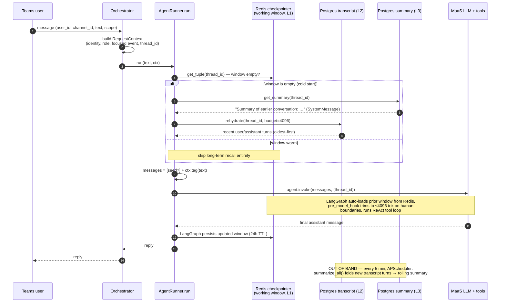

# EventBuddy — How the Agent Remembers

*How the conversational agent fetches and persists memory (Phase 1.7 layered memory stack).*

This document explains, end to end, how EventBuddy's LangGraph tool-calling agent reads
its **short-term** memory and its **long-term** memory, where each layer lives, and exactly
when each one is touched during a turn. File references are clickable.

---

## 1. The big picture: three layers, one key

Every layer is keyed by the same **scope-aware `thread_id`**, computed in
[context.py](../src/eventbuddy/agent/context.py#L26-L32):

| Scope | `thread_id` | Meaning |
|-------|-------------|---------|
| 1-1 DM | `dm:{user_id}` | private per-user conversation |
| Shared channel | `event:{channel_id}` | one shared thread across all channel members |

Because the three layers share this key, they describe **the same conversation** at three
different time horizons:

```
                 ┌──────────────────────────────────────────────────────────┐
                 │                    thread_id (the key)                     │
                 │            dm:{user_id}  |  event:{channel_id}             │
                 └──────────────────────────────────────────────────────────┘
                          │                   │                    │
            ┌─────────────▼───┐   ┌───────────▼─────────┐   ┌──────▼────────────┐
   Layer 1  │ WORKING WINDOW  │   │  DURABLE TRANSCRIPT  │   │  ROLLING SUMMARY  │  Layer 3
 (recent)   │ Redis, 24h TTL  │   │  Postgres (layer 2)  │   │ Postgres (layer 3)│  (oldest)
            │ full msg graph  │   │ user/assistant only  │   │ ≤200-word gist    │
            │ incl. tool calls│   │                      │   │                   │
            └─────────────────┘   └──────────────────────┘   └───────────────────┘
              ▲ read/written         ▲ read on cold-start        ▲ read on cold-start
              automatically every    (rehydrate)                 (get_summary)
              turn by LangGraph       refreshed out-of-band by the APScheduler job
```

- **Layer 1 — Working window** ([memory.py](../src/eventbuddy/agent/memory.py)): the live
  LangGraph message graph (human, AI, **and** tool-call / tool-result messages), held in
  **Redis** with a **24-hour TTL**. This is short-term memory.
- **Layer 2 — Durable transcript** ([transcript.py](../src/eventbuddy/agent/transcript.py)):
  **user/assistant turns only** (tool plumbing dropped), in Postgres
  `conversation_messages`. Survives the 24h TTL; the source for rehydrating a cold window.
- **Layer 3 — Rolling summary** ([summarizer.py](../src/eventbuddy/agent/summarizer.py)): a
  compact running gist (≤200 words) of everything older than the rehydration tail, in
  Postgres `session_summaries`. Refreshed **out of band** by a background job so it adds no
  per-turn latency.

Everything **degrades gracefully**: no Redis → an in-memory checkpointer; no Postgres / no
MaaS creds → those long-term layers are simply skipped, and the chat path itself falls back
to the regex router.

---

## 2. Short-term memory — the working window (Layer 1)

### Where it lives
[`build_checkpointer()`](../src/eventbuddy/agent/memory.py#L21-L30) returns a LangGraph
`RedisSaver` with a 24h TTL (`refresh_on_read=True`, so an active conversation keeps
sliding its expiry forward). Without `redis_url` it returns an `InMemorySaver` so dev/unit
runs work unchanged.

The checkpointer is a **shared singleton** wired once in
[wiring.py](../src/eventbuddy/agent/wiring.py#L102-L104) and handed to the runner.

### How the agent *fetches* it — automatically, via LangGraph
The agent never reads the working window by hand. In
[`AgentRunner.run`](../src/eventbuddy/agent/runner.py#L134-L168) the checkpointer is passed
into `create_react_agent(...)`, and every call is made with the thread key:

```python
config = {"configurable": {"thread_id": ctx.thread_id}, "recursion_limit": ...}
result = agent.invoke({"messages": messages}, config=config)
```

On `invoke`, LangGraph **loads the prior window for that `thread_id` from Redis**, appends
the new messages, runs the ReAct tool loop, and **persists the updated window back to
Redis** — all transparently. So "fetching short-term memory" = passing the right
`thread_id`; the checkpointer does the rest.

### Keeping the window inside the model's context budget
A `pre_model_hook` built by [`make_trimmer`](../src/eventbuddy/agent/runner.py#L50-L70)
trims the window to **≤4096 tokens** *just before each model call*. Critical detail: it cuts
**only on human/assistant boundaries** (`start_on="human"`) so a `tool_call` is never
separated from its `tool_result` — orphaning a `tool_call_id` makes the OpenAI/MaaS API
reject the request.

The trimmer writes to `llm_input_messages` (what the LLM *sees*), **not** to the stored
state — so trimming for context-budget reasons never deletes anything from Redis. Token
counting uses a dependency-free `~4 chars/token` approximation
([model.py](../src/eventbuddy/agent/model.py#L26-L46)), because tiktoken raises on
vendor-namespaced MaaS model IDs.

### Concurrency
[`session_lock`](../src/eventbuddy/agent/memory.py#L46-L69) is a Redis lock that serializes
concurrent posts to a shared `event:` thread, so two members posting at once can't clobber
the same checkpoint. No-op without Redis.

---

## 3. Long-term memory — fetched only on a *cold* window

Long-term layers are read **lazily, and only when the working window is empty** (TTL
expired, evicted, or a brand-new thread). This is the "seeding" step in
[`run`](../src/eventbuddy/agent/runner.py#L146-L151):

```python
if (transcript or summarizer) and self._window_empty(config):
    messages.extend(self._seed_messages(ctx))   # long-term recall
messages.append(ctx.tag(text))                  # the new human turn
```

[`_window_empty`](../src/eventbuddy/agent/runner.py#L119-L123) just asks the checkpointer
`get_tuple(config) is None`. When the window already has content, the long-term layers are
**not touched at all** — they're a cold-start recall mechanism, not a per-turn read.

[`_seed_messages`](../src/eventbuddy/agent/runner.py#L107-L117) assembles the seed in
oldest→newest order:

1. **Summary first** (Layer 3): `summarizer.get_summary(thread_id)` →
   `SystemMessage("Summary of earlier conversation: …")`.
2. **Transcript tail next** (Layer 2): `transcript.rehydrate(thread_id)` → the most-recent
   user/assistant turns that fit a 4096-token budget, oldest-first.

The result is prepended to the new human message and passed into `agent.invoke`, so the
freshly-seeded turns get written into the Redis window as a side effect — the next turn is
warm again.

### Layer 2 — durable transcript (Postgres `conversation_messages`)
[transcript.py](../src/eventbuddy/agent/transcript.py):

- **What's stored:** user/assistant turns only. `_durable()` filters out tool-call
  `AIMessage`s and `ToolMessage`s — those live solely in the Redis window.
- **`rehydrate(thread_id, budget=4096)`** ([L71-L90](../src/eventbuddy/agent/transcript.py#L71-L90)):
  pulls rows newest-first, keeps turns until the running token total would exceed the
  budget, then reverses to oldest-first. This is the read used during seeding.
- **`record_turn(...)`** (the live write path, Phase 1.9): appends exactly this turn's
  user + assistant pair, called by `AgentRunner._record_turn` after `agent.invoke`
  (best-effort). It also persists the real send-time in the `sent_at` column (see
  [EventBuddy-Cross-Context-Memory.md](EventBuddy-Cross-Context-Memory.md) Part A).
- **`flush_window(...)`** ([transcript.py](../src/eventbuddy/agent/transcript.py)): a *batch*
  write side. Idempotent via a per-thread high-water mark (count of already-persisted
  turns), and it stamps strictly-increasing `created_at` microseconds so rehydrate can order
  turns even though Postgres `now()` is identical within one transaction. Note its
  count-slice idempotency assumes the **full** window is passed each time — which is why the
  live per-turn path uses `record_turn` instead (a cold-seeded window holds only a *tail*,
  and the count slice would mis-skip new turns).

> ✅ **Update (Phase 1.9).** The durable write path is now wired: `AgentRunner._record_turn`
> persists each turn after `agent.invoke`, so `conversation_messages` (and the rolling
> summary that folds it) populate in production. This closed the earlier gap where
> `flush_window` was implemented but never called in the live path.

### Layer 3 — rolling summary (Postgres `session_summaries`)
[summarizer.py](../src/eventbuddy/agent/summarizer.py):

- **Read path (in the request):** `get_summary(thread_id)` — a single primary-key lookup,
  used during seeding.
- **Write path (out of band):** `summarize_session` folds transcript turns newer than the
  `covered_through` watermark into the prior summary via `LLMGateway.summarize` (a non-chat
  LLM call — **not** the ReAct loop), then advances the watermark. No new turns → no LLM
  call.
- **When it runs:** `summarize_all()` is invoked by the APScheduler job
  [`run_summarize_sessions`](../src/eventbuddy/scheduler/jobs.py#L19-L27), registered every
  **5 minutes** by [`schedule_summarizer`](../src/eventbuddy/scheduler/triggers.py#L29-L34)
  from [main.py](../src/eventbuddy/main.py). Doing it on a timer keeps summary maintenance
  off the user's request latency.

---

## 4. Sequence diagram — a single turn



---

## 5. Quick reference

| Concern | Layer 1 — Working window | Layer 2 — Transcript | Layer 3 — Summary |
|---|---|---|---|
| Store | Redis (`RedisSaver`) | Postgres `conversation_messages` | Postgres `session_summaries` |
| Lifetime | 24h TTL, slides on read | durable | durable |
| Contents | full graph incl. tool calls | user/assistant turns only | ≤200-word gist |
| Read by agent | **every turn**, automatically by LangGraph | **cold start only**, `rehydrate()` | **cold start only**, `get_summary()` |
| Written | every turn by LangGraph | `record_turn()` after each turn (Phase 1.9) | APScheduler job, every 5 min |
| Degrades to | `InMemorySaver` | skipped (no DB) | skipped (no DB / no creds) |
| Code | [memory.py](../src/eventbuddy/agent/memory.py) | [transcript.py](../src/eventbuddy/agent/transcript.py) | [summarizer.py](../src/eventbuddy/agent/summarizer.py) |

**One-line mental model:** the agent reads short-term memory *implicitly every turn* (Redis,
via the `thread_id`), and reaches into long-term memory *only when the short-term window has
gone cold* — summary first for the broad gist, then the durable transcript tail for recent
detail — while the rolling summary is kept fresh on a 5-minute background timer.
